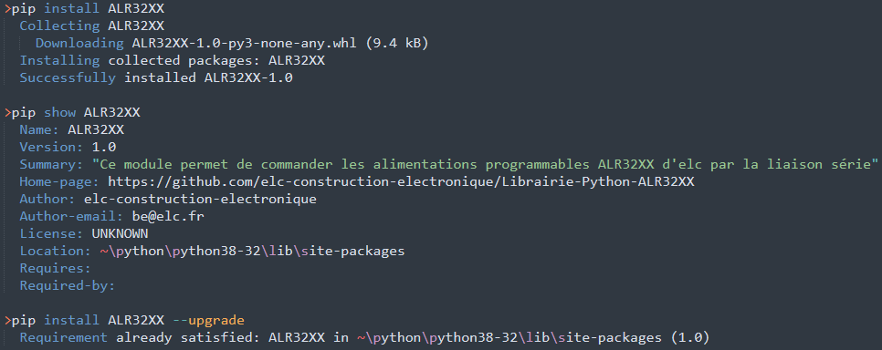

# Librairie-Python-ALR32XX

Documentation complète de la librairie : https://elc-construction-electronique.gitbook.io/librairie-python-alr32xx/

 
Librairie <a href="https://www.python.org/downloads/" title="Lien d téléchargement Python"> Python</a> pour piloter les alimentations programmables <strong>ALR3220, ALR3203, ALR3206D/T</strong> par une liaison série (USB, RS232, RS485). 

<h2>Installation du module</h2>

Le module ALR32XX necessite d'avoir installé Python et la librairie PySerial : <a href="https://pythonhosted.org/pyserial/pyserial.html">pip install pyserial</a>. La procédure d'installation est detaillée dans le gitbook à la page <a href="https://elc-construction-electronique.gitbook.io/librairie-python-alr32xx/utilisation-de-la-librairie-python/installation-de-la-librairie">Installation de la librairie</a>.

L'installation de la librairie ALR32XX se fait alors de deux façons : 
<ul>
	<li>Utilisation du code dans un projet : 
		Telechargez le .zip via le <a href="https://github.com/elc-construction-electronique/Librairie-Python-ALR32XX">repository github</a>. Dans ce dossier vous trouverez le code source ALR32XX.py, un dossier avec des exemples d'utilisation et un dossier avec les documentations de la librairie et des alimentations. 
	<li>Téléchargement de la librairie via Pip :
		Notre librairie ALR32XX est accessible via <a href="https://pypi.org/project/ALR32XX/">PyPI</a>, la rendant téléchargeable par la commande "pip install ALR32XX".  Vous pouvez trouver des renseignements et la version de la librairie par la commande "pip show ALR32XX" et, si besoin, la mettre à jour par "pip install ALR32XX --upgrade". 
		
</ul> 
	
<h2>Utilisation du module</h2>

Une fois l'installation terminée vous pouvez acceder à la bibliothèque par "from ALR32XX import *".  
Reliez l'alimentation à l'ordinateur par USB, RS232 ou RS485. Vous pouvez verifier la connexion dans le gestionnaire de périphérique et sur l'ecran de l'alimentation : 

Le programme fonctionne sous la forme d'une classe, il faut declarer un objet qui correspondra à l'alimentation. Par exemple pour une ALR3203, la declaration se fera par "nom=ALR32XX('ALR3203')". Le programme tente alors d'établir automatiquement une communication avec l'alimentation et renvoie Port=COM3; Nom=ALR3203; Connexion=OK. 
Si la tentative échoue, il vous sera demandé de connecter l'alimentation manuellement par la fonction Choix_port(). Cette fonction va lister vos ports actifs et vous demandera d'entrer le numéro de celui qu'il faut connecter :

 
Une fois la connexion réussie, vous pouvez utiliser la librairie. Par exemple X.Mesure_tension() pour mesurer la tension de votre ALR3203. Une liste des fonctions disponibles est donnée dans la <a href="https://github.com/elc-construction-electronique/Librairie-Python-ALR32XX/tree/main/Documentation">documentation</a> et sur le  <a href="https://elc-construction-electronique.gitbook.io/librairie-python-alr32xx/utilisation-de-la-librairie-python/installation-de-la-librairie">Gitbook</a>

Crédits : Incluez une section pour les crédits afin de mettre en évidence et de lier les auteurs de votre projet.

Licence : Enfin, incluez une section pour la licence de votre projet. Pour plus d'informations sur le choix d'une licence, consultez le guide de licence de GitHub !
Votre fichier README ne doit contenir que les informations nécessaires aux développeurs pour commencer à utiliser votre projet et à y contribuer. Une documentation plus longue est mieux adaptée aux wikis, comme indiqué ci-dessous.

<body>
	

		
 <h3>  Texte introductif </h3>

		
 Cette librairie en python a été réalisé pour permettre aux utilisateurs des alimentations ELC de piloter à distance <strong> les alimentations programmables ALR3203, ALR3220, ALR3206D et ALR3206T </strong>. Pourquoi avoir choisi python ? Tout simplement parce qu'il s'agit d'un langage open source et du langage le plus apprécié des developpeurs. Python est disponible et téléchargeable <strong> <a href="https://www.python.org/downloads/" title="Lien vers le téléchargement de Python"> ICI </a> </strong>. 
		

		

	

	

		<ul class="slides">
		<li></li>
    		<li></li>
    		<li></li>
    		<li></li>
    		</ul>
	

	

		
 <h3>  Caractéristiques des alimentations </h3>

		<table>
			<tr>
				<th> ALR3206T </th>
				<th> ALR3206D </th>
				<th> ALR3220 </th>
				<th> ALR3203 </th>
			</tr>
			<tr>
				<td>
					<ul>
						<li> Alimentation 3 voies</li>
						<li>Puissance 400W max </li>
						<li>Tension 0-32V / courant 0-6A sur les voies 1 et 2 </li>
						<li>Tension 0-15V / courant 0-3A / puissance 15W sur la voie 3 </li>
						<li>Mode série (0-64V/0-6A) et mode parallèle (0-32V/0-12V) pour
les voies 1 et 2 </li>
						<li>Résolutions 10mV et 2mA sur les voies 1 et 2 </li>
						<li>Résolutions 10mV et 10mA sur la voie 3 </li>
						<li>Communication USB et RS485. Option RSETHER : adaptateur
ETHERNET </li>
						<li>Protection contre les courts-circuits, les échauffements
excessifs et les surintensités à l’entrée du secteur </li>
						<li> OVP/OCP pour éviter les surtensions et surintensités</li>
						<li>Rendement > 80% à puissance maximale </li>
						<li>Température de fonctionnement : +5 à +40°C </li>
						<li>Fonction en U et I (arbitraire, carré, rampe montante et
descendante, temps de montée et descente) </li>
						<li>Drivers et exécutable LabVIEW fournis </li>
						<li>Consommation 495W maxi </li>>
					</ul>
				</td>
				<td>
					<ul>
						<li> Alimentation 2 voies</li>
						<li>Puissance 385W max </li>
						<li>Tension 0-32V / courant 0-6A sur les voies 1 et 2 </li>
						<li>Mode série (0-64V/0-6A) et mode parallèle (0-32V/0-12V) </li>
						<li> Résolutions 10mV et 2mA sur les voies 1 et 2 </li>
						<li>Communication USB, RS232, RS485 et RS422 vers ETHERNET </li>
						<li> Protection contre les courts-circuits, les échauffements excessifs et les surintensités à l’entrée du secteur</li>
						<li>OVP/OCP pour éviter les surtensions et surintensités </li>
						<li>Rendement > 78% à puissance maximale </li>
						<li> Température de fonctionnement : +5 à +40°C</li>
						<li> Fonction en U et I (arbitraire, carré, rampe montante et
descendante, temps de montée et descente)</li>
						<li>Drivers et exécutable LabVIEW fournis </li>
						<li>Consommation 490W maxi </li>
					</ul>
				</td>
				<td>
					<ul>
						<li>Alimentation 1 voie </li>
						<li>Puissance 640W max</li>
						<li>Tension 0-32V / courant 0-20A </li>
						<li> Résolutions 10mV et 10mA</li>
						<li>Communication USB, RS232, RS485, (option LAN), 0-10V </li>
						<li>Protection contre les courts-circuits, les échauffements excessifs et les surintensités à l’entrée du secteur </li>
						<li> OVP/OCP pour éviter les surtensions et surintensités</li>
						<li> Rendement > 84% à puissance maximale</li>
						<li>Température de fonctionnement : +5 à +40°C </li>
						<li>Fonction en U et I (arbitraire, carré, rampe montante et descendante, temps de montée et descente) </li>
						<li>Drivers et exécutable LabVIEW fournis </li>
						<li>Consommation 770W maxi </li>
					</ul>
				</td>
				</td>
				<td>
					<ul>
						<li> Alimentation 1 voie </li>
						<li> Puissance 96W max </li>
						<li> Tension 0-32V / courant 0-6A </li>
						<li> Résolutions 10mV et 2mA </li>
						<li> Communication USB </li>
						<li> Protection contre les courts-circuits, les échauffements excessifs et les surintensités à l’entrée du secteur </li>
						<li> OVP/OCP pour éviter les surtensions et surintensités </li>
						<li> Rendement > 78% à puissance maximale </li>
						<li> Fonction en U et I (arbitraire, carré, rampe montante et descendante périodique, temps de montée/descente monocoup) </li>
						<li> Drivers et exécutable LabVIEW fournis </li>
						<li> Température de fonctionnement : +5 à +40°C </li>
						<li> Consommation 126W maxi </li>
						<li> Drivers et exécutable LabVIEW fournis </li>
					</ul>
				</td>			
			</tr>
		</table>
	

	
 <h3>  Liste des fonctions </h3>

	
Pour utiliser la bibliothèque de fonctions, il faut installer le module <a href="https://pypi.org/project/pyserial/"> PySerial </a>. C'est lui qui permet d'établir la communication entre les alimentations et le PC. Voici la liste des fonctions de la bibliothèque <a href="https://github.com/ELC-annecy/Librairie-Python-ALR32XX/blob/main/ALR32XX.py"> ALR32XX </a>.
	

	<ul>
		<li> __init__(self, c_nom=’ ‘) </li>
		<li>List_port (self)  </li>
		<li>Choix_port (self)  </li>
		<li> Deconnexion (self) </li>
		<li> IDN (self) </li>
		<li> Read_state_ALR (self, c_parametre=’OUT’)  </li>
		<li> OUT(self, c_mode=’ ‘, c_out=1) </li>
		<li> ALR (self, c_mode=’NORMAL‘) </li>
		<li> Remote(self, c_mode=’REMOTE’) </li>
		<li> STO(self, c_case_memory=1) </li>
		<li> RCL(self, c_case_memory=1) </li>
		<li> TRACK(self, c_mode=’ISOLE’) </li>
		<li> Mesure_tension(self, c_voie=1) </li>
		<li> Consigne_tension (self, c_voie=1) </li>
		<li> Mesure_courant (self, c_voie=1) </li>
		<li> Consigne_courant (self, c_voie=1) </li>
		<li> Ecrire_courant(self, c_valeur=0, c_voie=1) </li>
		<li> Ecrire_tension(self, c_valeur=0, c_voie=1)</li>
		<li> OCP(self, c_valeur=0, c_voie=1) </li>
		<li> OVP(self, c_valeur=0, c_voie=1)</li>
		<li> OVP_OCP(self, c_parametre='OVP', c_voie=1)</li>
	</ul>
	

	

		
 <h3>  Exemples </h3>

		
 Voici quelques exemples d'utlisation de la librairie 

		
 <strong> <a href="https://github.com/ELC-annecy/Librairie-Python-ALR32XX/blob/main/Exemples/Exemple_1.py" title="Exemple 1"> Exemple 1 </a> </strong>

		
 <strong> <a href="https://github.com/elc-construction-electronique/Librairie-Python-ALR32XX/blob/main/Exemples/Exemple_2.py" title="Exemple 2"> Exemple 2 </a> </strong>

		
 <strong> <a href="https://github.com/elc-construction-electronique/Librairie-Python-ALR32XX/blob/main/Exemples/Exemple_3.py" title="Exemple 3"> Exemple 3 </a> </strong>

		
 ... 

	

	

		
 <h3> Crédits </h3> 

		<ul>
			<li> Alex MIOLLANY </li>
			<li> John-Yvan MOUBA </li>
		</ul>
	

</body>
